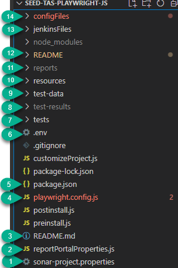
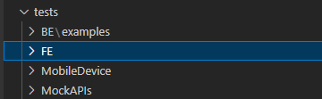
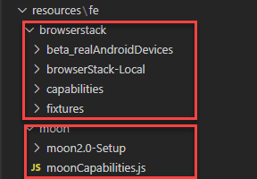

# Playwright-seed Content Guide

## Versioning

We will use a simple **YY.MM.build** as naming convention for major releases of this seed(Please refer package.json for version details).

## Main Content Structure
(updated in v22.12.09)

1. **sonar-project.properties** -> Sonar properties file. Sonar project name can be modified here.
2. **reportPortalProperties.js** -> Test Report Portal properties file. Modify as required.
3. **README.md** -> File containing the documentation
4. **playwright.config.js** -> Playwright Test Default Configuration file. Default execution options: Local browsers, Browserstack and Moon, devices etc.
5. **package.json** -> All the dependencies required for integrations are specified here. Various npm scripts are also added to facilitate executions.
6. **.env** file -> Env variables for setting up moon certificates. Specify in config file - require('dotenv').config()
7. **tests** -> Test Directory for Front end, Back end, Mock API and Kafka code examples.
   
   
8. **test-results** -> folder where test artifacts are stored. Can be modified from the config file.
9. **test-data** -> Test data module. Import for using in test spec files.
10. **resources** -> resources folder contains moon2.0 certificates and browserstack capabilities and fixtures.
    1.  **browserstack**
        - **beta_realAndroidDevices** -> Fixtures for running tests on real android devices available on BrowserStack
        - **browserStack-Local** ->  setup and teardown files for BrowserStack Local
        - **capabilities** -> BrowserStack capabilities
        - **fixtures** -> browserstack fixtures - Import {browser}/{context}/or {page} fixture in the test file as required
    2. **moon**
        - **moon2.0-Setup** -> contains moon certificates
        - **moonCapabilities.js** -> Capabilities file for Moon. Modify as required

    
11. **reports** -> Reports folder. Playwright HTML report, Allure report, junit.xml report can be directly accessed from here.
12. **ReadMe Folder** -> Folder containing documentation files and images used in those files.
13. **jenkinsFiles** -> Here you will find Groovy pipelines examples for Jenkins. Examples showing how to build your own Continuous Integration in Test complete pipelines and providing examples for integrating your executions into the rest of the adidas standard tools, for executing your tests in our different environments and platforms, and for reporting and notifications options.
14. **configFiles** -> Playwright provides option to pass a specific config file using *--config* flag. Various options are provided for executing FE/BE executions. Contains config files for:
    1.  BE
    2.  FE ->
        1. BrowserStack + BrowserStack Local
        2. LocalBrowsers
        3. MobileDeviceEmulation
        4. Moon
        5. RealAndroidDevices

Continue to [Playwright Seed User Guide](PlaywrightUserGuide.md).
