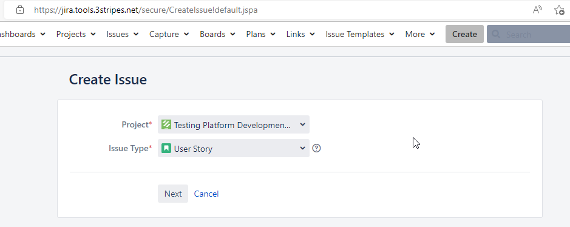

# Contributor Guide

## Important note

To contribute with this project, please ensure you have read the [Playwright Content Guide](PlaywrightContentGuide.md). In this guide, you will find complete information about the structure and the content of this seed, and about the technical decisions made by the rest of the developers and contributors of this project.

## Introduction
Thank you for considering becoming a contributor!

We are totally convinced that we all together can improve and extend our adidas Standard Test Framework to help the whole adidas Testing Community to test better, faster and more efficiently.

## How can you contribute
There are several ways your contributions and feedback will help:
- Identifying and reporting issues
- Sending ideas for missing features and capabilities
- Developing testing libraries, classes, methods and examples for others to re-use
- Developing or improving integrations with other adidas standard tools.

In the next sections, you will find specific information and steps to follow.

**Many thanks in advance for your support and help!**

## How to contribute
### General
1. **IMPORTANT NOTE!!**

Please check our current backlog previous to submit any new feedback [TPD - Playwright-seed BACKLOG](https://jira.tools.3stripes.net/issues/?jql=project%20%3D%20TPD%20AND%20component%20%3D%20automation_cloud%20AND%20labels%20%3D%20playwright-seed%20AND%20issuetype%20in%20(Sub-task%2C%20%22User%20Story%22)%20AND%20status%20!%3D%20Closed). If you find your idea already there, you will find detailed status about the initiative and who to contact to in order to collaborate on it.

IN CASE OF ANY DOUBT, you can directly contact us at any time through our Microsoft Teams channel [SUPPORT_TESTING](https://teams.microsoft.com/l/channel/19%3a9887ce8b989549f7ba468c80885926da%40thread.tacv2/SUPPORT_TESTING?groupId=9ebcbabe-a60f-4b1f-bf48-a51d799159f0&tenantId=3bfeb222-e42c-4535-aace-ea6f7751369b) or via email [pea.test_engineering@adidas.com](mailto:pea.test_engineering@adidas.com).

### Suggest a new feature
If you want to suggest a new feature or improvement, or to report an issue, open a new issue in our Jira project. Use the following information to properly clasify it:

Project: TPD (Testing Platform Development)
Issue type: User Story
Component: automation_cloud
Labels: playwright-seed

Click here to [**create a new issue.**](https://jira.tools.3stripes.net/secure/CreateIssue!default.jspa)

### Work on an approved new feature
If you want to contribute to accepted or in progress improvements, check the list of issues in the roadmap [here](https://jira.tools.3stripes.net/issues/?jql=project%20%3D%20TPD%20AND%20component%20%3D%20automation_cloud%20AND%20labels%20%3D%20playwright-seed%20AND%20issuetype%20in%20(Sub-task%2C%20%22User%20Story%22)%20AND%20status%20not%20in%20(Open%2C%20Closed)).

You will find detailed information in each issue about the value, the scope and the current status. Contact the issue assignee for any of them you want to work on. And, **thanks a lot in advance!**

### Extend examples and code base, fix issues and improve documentation
If you want directly to make changes in the code, adding more examples, libraries, classes and methods or solving existing issues:

- Fork the main repository.
- Make your changes.
- Test them.
- Make a pull request to the develop branch in the main repository.
- Sonarqube and some tests will run and display the results in the BitBucket pull request user interface.
- We will review your code and merge it if there are no issues.

### Any other feedback
Test Engineering team backlog is built based on adidas Testing Community needs, always aligned with the adidas High Level priorities. Any feedback from you will be more than welcome and hugely appreciated by us. Please, don't hesitate on contact us at any time through our Microsoft Teams channel [SUPPORT_TESTING](https://teams.microsoft.com/l/channel/19%3a9887ce8b989549f7ba468c80885926da%40thread.tacv2/SUPPORT_TESTING?groupId=9ebcbabe-a60f-4b1f-bf48-a51d799159f0&tenantId=3bfeb222-e42c-4535-aace-ea6f7751369b) or via email [pea.test_engineering@adidas.com](mailto:pea.test_engineering@adidas.com).