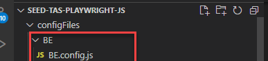
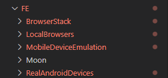

# Getting Started

## Required softwares

- [node.js](https://nodejs.org/) 
- Software to clone this repository (e.g. SourceTree, Git installed locally...)
- IDE like VS code

## Set-Up your project

- Clone this repository
- Open in VS Code
- run 'npm install'

The above steps will download all the required dependencies for this project. You can further customize the project as described in next section.
## Customize your project
(Added v23.08.13)

To customise your project, execute the following in the terminal after running an "npm install":
```
npm run customize
```

This will prompt few questions allowing you to choose the focus area for your project.(Default answer is yes!).

## Features and Configurations 

In this seed, we are using the **Playwright Test** test runner.

### Key Features:
 - **Cross - Browser Testing**: Supported browsers Chromium, WebKit and Firefox(specified as projects in the config files)
 - **Cross - Platform Testing**: Tests can be executed on Moon and BrowserStack
 - **Parallelization**: Parallel test executions supported
 - **XRAY Integration**: Test Executions linked to JIRA Test cases for Traceability 
 - **Test Reporting Portal Integration**: Integrating with TRP through CI process
 - **Reporting Aspects**: Integrated playwright HTML report, junit report and allure reporting capabilities


## Playwright Configuration Files

*Playwright Test* test runner, accepts configuration files where global configurations can be specified. Configuration files facilitate various key features provided by Playwright Test runner like:
- running tests in multiple browsers(Multiple browsers specified as Projects)
- specify retries and tracing options, 
- capture screenshot and/or video based for test executions etc
- headed/headless executions

**Note**: Some configurations can also be specified locally in tests using *test.use(options)*. Please refer to official documenation for specific use cases - https://playwright.dev/docs/test-configuration.

This seed is pre-configured with the different config files which can be passed through CLI command using the *--config* flag. 

```
npx playwright test --config=./configFiles/FE/BrowserStack/BrowserStack.config.js
```

## Configuration files in this seed

### 1. Default Configuration file:

- **playwright.config.js** is the default configuration file.
- Supported browsers/Platforms(specified as projects):
    - **Playwright Local Workers**: Chromium, Firefox and Webkit
    - **Moon** - Chromium, Chrome, Webkit, Firefox
    - **Browserstack** - Chrome, Edge, Firefox, Webkit
    - **Emulated devices**
    - **Real android project demo example**
- Unless specified in CLI command, by default tests will be **executed in parallel on all the above projects**.

### 2. Other config file options 
(updated in v22.12.09)
**configFiles** folder contains additional config files which can be passed in CLI command using **--config** flag.

#### 2.1 BE config files:



- Suitable for **Back End API Tests**
- Specify in the CLI command using *--config* flag.

#### 2.2 FE Config files:



- **BrowserStack** folder contains config files for browserstack and browserstack local.
- **LocalBrowsers** folder contains config files for local browsers
- **MobileDeviceEmulation** folder contains config files for running tests on supported mobile devices. Tests will be **executed on the emulated devices specified in the project matrix.**
- **Moon** older contains config files for Moon Browsers.
- **RealAndroidDevices** for running tests on real android devices on BrowserStack
- Specify in the CLI command using *--config* flag.

Continue to the next section - [01-Run Front End Tests on local browsers](01-FeLocalBrowsers.md).
List of useful playwright execution commands - [Playwright CLI Command List](MISC-Miscellaneous-Useful%20Playwright%20CLI%20Commands.md).