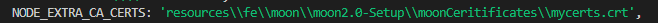

# 2. Run Front End on Moon
(Updated in v23.09.14)

The seed is upgraded to execute tests on Moon2.0.

The required certificates are at the path - **resources\fe\moon\moon2.0-Setup\moonCeritificates** and are set as environment variables through the **.env** file.
Modify moon capabilities at the path - **resources\fe\moon\moonCapabilities.js**

Note - 
- In order to set the environment, make sure to add the below in your config file. 
    ```
    require('dotenv').config();
    ```

- To confirm if the environment variable is set:
  - Execute -
    ```
    node resources\fe\moon\moon2.0-Setup\index.js
    ```
  - You should see something like the below in the terminal:
  
       

## 2.1 Config options for moon

- headless=true&&enableVideo=false --> No real time video, no VNC session and no video in s3
- headless=false&enableVideo=false -> Real time video(yes), VNC session (yes) and no video in s3
- headless=false&enableVideo=true -> Real time video(yes), VNC session (yes) and video in s3 (yes)
- headless=true&enableVideo=true -> No real time video, no VNC session and no video in s3

The above can be updated in the moonConfigs in [moonCapabilities.js](../../resources/fe/moon/moonCapabilities.js) file as :

```
const moonConfigs = {
  playwrightVersion: playwrightClientVersion,
  projectNameMoon: "seed-tas-playwright-js" /** Update as required */,
  headlessMoon: false /** Refer documentation - UserGuide/02-FeMoon for options  */,
  enableVideoMoon: false,
  pattern:
    process.env
      .PW_S3_FOLDER_LOCAL /** S3 bucker folder name if enableVideoMoon is set to true*/,
};
};
```

## 2.2 Parallel execution on all specified Moon projects

```
npx playwright test --config=./configFiles/FE/Moon/Moon.config.js
```

## 2.3 Execution on specific Moon Browsers

### Chromium

```
npx playwright test --config=./configFiles/FE/Moon/Moon.config.js --project='chromium@moon'
```
### Chrome

```
npx playwright test --config=./configFiles/FE/Moon/Moon.config.js --project='chrome@moon'
```

### Firefox

```
npx playwright test --config=./configFiles/FE/Moon/Moon.config.js --project='firefox@moon'
```

### Webkit

```
npx playwright test --config=./configFiles/FE/Moon/Moon.config.js --project='webkit@moon'
```

## 2.4 Saving video recording

Moon 2.0 offers video recording capability for test executions. Steps to activate the recording and downloading the video:

1. Set the **enableVideoMoon** property to true in **moonConfigs** in the moonCapabilities file.
    ```
    const moonConfigs = {
      playwrightVersion: '1.27.1',
      projectNameMoon: 'seed-tas-playwright-js',
      headlessMoon: false,
      enableVideoMoon: true,
      pattern: process.env.PW_S3_FOLDER_LOCAL, 
    };
    ```
2. Save 'PW_S3_FOLDER_LOCAL' as env variable in the .env file. This will be the name of the folder in S3 bucket where recording will be stored. 
3. For jenkins, we are using env variable: 
    ```
   'PW_S3_FOLDER' = "${JOB_NAME}-${BUILD_NUMBER}" 
    ```
4. For video name, it is necessary the format is '.mp4' and here we are concatenating ['TEST_WORKER_INDEX'](https://playwright.dev/docs/api/class-workerinfo#worker-info-worker-index) environment variable to save recoding based on worker index during test execution.

    ```
    wsEndpoint: `wss://moon.testing.aws.3stripes.net/playwright/chromium/playwright-`+`${moonConfigs.playwrightVersion}`
    +`?name=`+`${moonConfigs.projectNameMoon}`
    +`&headless=`+`${moonConfigs.headlessMoon}`
    +`&enableVideo=`+`${moonConfigs.enableVideoMoon}`
    +`&pattern=`+`${moonConfigs.pattern}`                /**S3 bucket folder name */
    +`&videoName=chromium-moon-`+process.env.TEST_WORKER_INDEX+`.mp4`     /** Video recording will be saved with this name */
    ,}
    ```
    As an example, please refer [configFiles/FE/Moon/Moon.config.js](../../configFiles/FE/Moon/Moon.config.js).

5. Install aws cli on your machine
6. Request your s3 IAM user through [SUPPORT_TESTING](https://teams.microsoft.com/l/channel/19%3a9887ce8b989549f7ba468c80885926da%40thread.tacv2/SUPPORT_TESTING?groupId=9ebcbabe-a60f-4b1f-bf48-a51d799159f0&tenantId=3bfeb222-e42c-4535-aace-ea6f7751369b) channel.
7. Set you IAM user by running:
    ```
    aws configure
    ```
8. Download your video by running the below command.
  **{S3-Folder-Name}** will be the folder name value specified as pattern in Step 1 and **{Local-Disk-Path}** is the path on your disk where you want to download the stored artifacts.
    ```
    aws s3 cp s3://moon-storage/{S3-Folder-Name}/ ./{Local-Disk-Path} --recursive 
    ```

Continue to the next section - [03-Run Front End Tests on BrowserStack and BrowserStackLocal](03-FeBrowserStack.md).