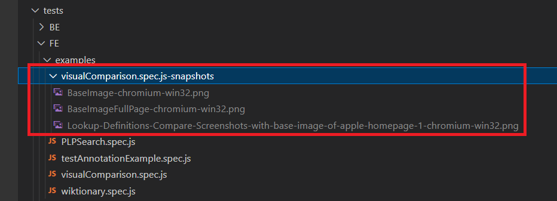
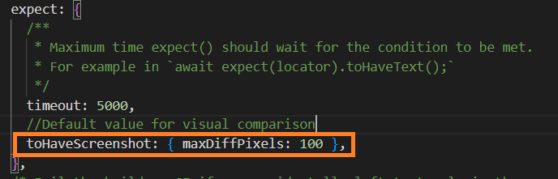

# 4. Visual testing with Playwright

Playwright Test provides the ability to produce and visually compare screenshots using await **expect(page).toHaveScreenshot().** or **expect(locator).toHaveScreenshot([options])**.

## 4.1 How it works?

- By default, the *golden image(base image for comparison)* is not present.
- On *first execution*, the test executions will fail, by design. However, Playwright test will also generate *reference screenshots* on first execution. Error message upon first execution:
    ```
    Error: example.spec.ts-snapshots/example-test-1-chromium-darwin.png is missing in snapshots, writing actual.

    ```
- Subsequent runs will compare against the reference. (please refer section 4.4 below for details on how comparison is done)

## 4.2 Naming convention



- After first execution, base images are saved in **<testFile-name>-snapshots** folder. 
- The snapshot name BaseImage-chromium-win32.png consists of a few parts:
    - BaseImage: Snapshot name passed as the first argument of the toHaveScreenshot() method
    - chromium: The browser/project name
    - win32: Name of the platform


### 4.2.1 Important Thing to Consider:

- **Generated screenshots differ between browsers and platforms** due to different rendering, fonts and more, so you will need different snapshots for them.
- **For testing on a particular machine/operating system/server, base images should be generated on that machine.** (Same applies for CI process)
- Lazy images and dynamic elements need to be handled to ensure accuracy in comparison results.

## 4.3 To update base image:

Base images can be updated using the **--update-snapshots** flag.
```
npx playwright test --update-snapshots
```

## 4.4 Comparing Pixels

Playwright Test uses the **pixelmatch** **library** for visual comparisons. More about [Pixelmatch](https://github.com/mapbox/pixelmatch).

## 4.5 Visual Testing examples covered in this seed

The test file **visualComparison.spec.js** contains sample visual comparison tests for-

- Comparing **full page** Screenshots
- Comparing Screenshots of **specific elements**
- Comparing Browser Screenshots (limited to window size)

Customizations can be done at local and/or global level, eg:

- Pass options to customize the snapshot comparison and have a generated name.
```
expect(await page.screenshot()).toMatchSnapshot({
  maxDiffPixels: 27, // allow no more than 27 different pixels.
});
```
- Configure image matching threshold and snapshot name.
```
expect(await page.screenshot()).toMatchSnapshot({
  name: 'landing-page.png',
  threshold: 0.3,
});
```

- For this seed the default maxDiffPixels is set to 100 in the global configuration files.

    


## 4.6 Assertions for visual comparison

1. **expect(locator).toHaveScreenshot([options])** - This function will wait until two consecutive page screenshots yield the same result, and then compare the last screenshot with the expectation.

2. **expect(screenshot).toMatchSnapshot(name[, options])** - Ensures that passed value, either a string or a Buffer, matches the expected snapshot stored in the test snapshots directory.

Continue to the next section - [05-Mobile Device Emulation - Testing on mobile devices](05-TestingOnMobileDevices.md).