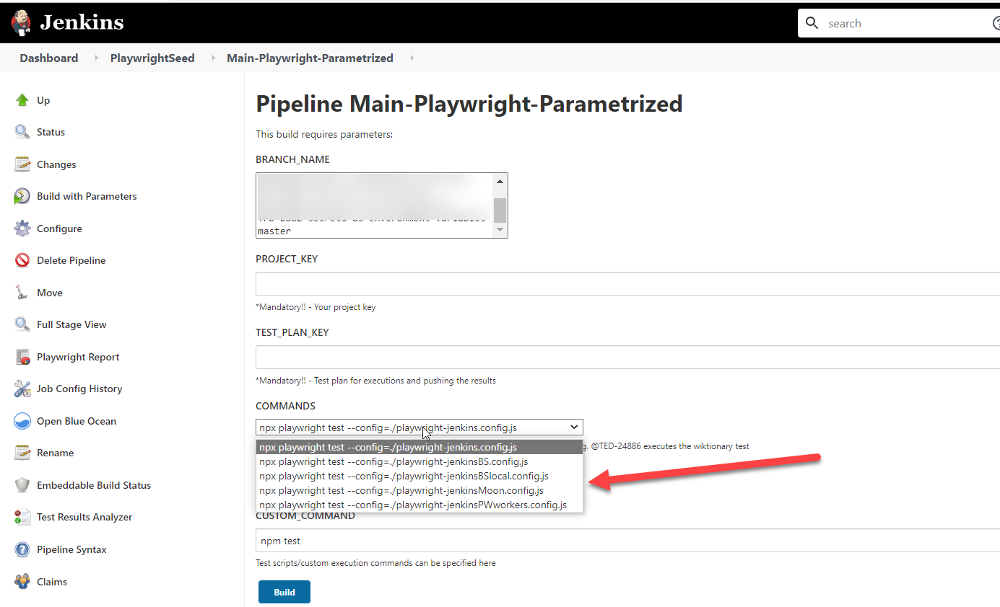
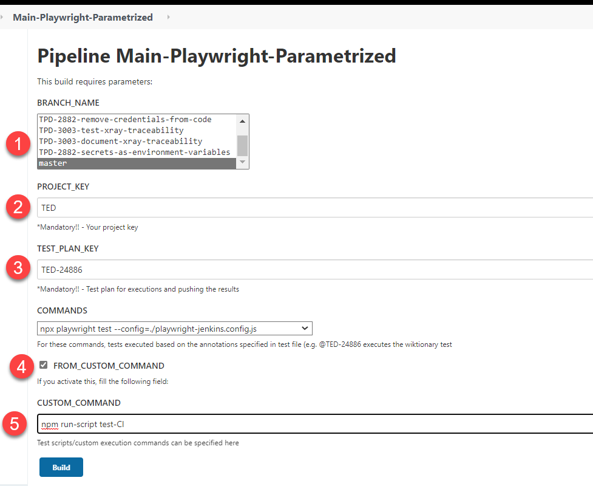

# 8. Execute Playwright from Jenkins

In this section we will explain how to integrate your test execution in Jenkins. Take a look of our [parametrized pipeline example](../../JenkinsFiles/Main-Playwright-Parametrized.groovy)

## 8.1 Variables and Configurations


- The jenkins file executes tests using the agent **'ubuntu_node-18_playwright'** which is a fixed agent configured with all the dependencies needed to execute our standard adidas Testing tools. The agent is available in all Jenkins as a Service Instances.

#### 8.1.1 Global Variables used in the pipeline:
```
def xrayImportUrl = "https://jira.tools.3stripes.net/rest/raven/1.0/import/execution/junit" //DO NOT MODIFY
def rpUrl = "https://testreportingportal.tools.3stripes.net" //DO NOT MODIFY

def svc_credentials = "svc_testautomation" //UPDATE ACCORDING TO YOUR NEEDS
def rpCredentials = "test-reporting-portal-pea-test_engineering" //UPDATE ACCORDING TO YOUR NEEDS
def projectName = "te-seed-tas-playwright-js" //UPDATE ACCORDING TO YOUR NEEDS
def email = "pea.test_engineering@adidas.com" //UPDATE ACCORDING TO YOUR NEEDS
```

#### 8.1.2 Environment Variables used in the pipeline:
```
    environment {
        NPM_CONFIG_CACHE = "${WORKSPACE}/.npm"                               //Do not modify
        ENV = tools.git.getSimplifiedBranchName()                            //Do not modify
        BUILD = "${BUILD_NUMBER}"                                            //Do not modify
        CI = true                                                            //Do not modify
        RP_TOKEN = credentials('test-reporting-portal-pea-test_engineering') //Update as required
        RP_PROJECT = 'te-seed-tas-playwright-js'                             //Update as required
        RP_DESCRIPTION = "${JOB_URL}${BUILD_NUMBER}"                         //Do not modify
        WEBHOOK_CREDENTIALS = credentials("jenkins-teams-webhook-url")       //Update as required
        BROWSERSTACK_USERNAME = "peatestengineeri1"                          //Update as required
        BROWSERSTACK_ACCESS_KEY = credentials("peatestengineeri1")           //Update as required
    }
```

## 8.2 Parameterised Pipeline

- The pipeline is **parameterised** so as to provide multiple execution option in a single jenkins file. 
    - **PROJECT_KEY** and **TEST_PLAN_KEY** are mandatory to be filled, as these values are required for XRAY integration.
    - If left blank, the execution will fail in 'Checkout & Collect Info' stage.
    - **Imp Note!!-** 
        - It is important to ensure correct **TEST_PLAN_KEY** is provided as the test executions will be linked to this Test Case ID in Jira.
        - If executing using commands from the 'choice parameter', the test case also needs to have the @<TEST_PLAN_KEY> annotation so that that particular test case is executed and results linked.


```
    parameters{
        gitParameter branchFilter: 'origin/(.*)', defaultValue: 'master', name: 'BRANCH_NAME', type: 'PT_BRANCH'
        string(name: 'PROJECT_KEY', defaultValue: '', description: '*Mandatory!! - Your project key')
        string(name: 'TEST_PLAN_KEY', defaultValue: '', description: '*Mandatory!! - Test plan for executions and pushing the results')
        choice(name: 'COMMANDS', choices: [
            'npx playwright test --config=./configFiles/FE/BrowserStack/BrowserStack.config.js',
            'npx playwright test --config=./configFiles/FE/LocalBrowsers/LocalBrowsers.config.js',
            'npx playwright test --config=./configFiles/FE/Moon/Moon.config.js',
            'npx playwright test --config=./configFiles/FE/MobileDeviceEmulation/MobileDevices.config.js',
            'npx playwright test --config=./configFiles/FE/RealAndroidDevices/RealAndroid.config.js',
            'npx playwright test --config=./configFiles/BE/BE.config.js'                                  
            ], description: 'For these commands, tests executed based on the annotations specified in test file (e.g. @TED-24886 executes the wiktionary test')
        booleanParam(name: 'FROM_CUSTOM_COMMAND', defaultValue: false, description: 'If you activate this, fill the following field:')
        string(name: 'CUSTOM_COMMAND', defaultValue: 'npm test', description: 'Test scripts/custom execution commands can be specified here')
    }
```

## 8.3 Libraries
- The **Global Jenkins Library** and our **TaasWrapper** is added to our pipeline to allow us to use simplified methods in our code and significantly reduced complexity and maintenance effort.
- Steps to add libraries in your pipeline:
    - First, you must configure the libraries in Jenkins. You must go to Configure menu inside your Jenkins project folder, adding the libraries in the Pipelines Libraries section. Data you will need:

        - **Library Name:** GlobalJenkinsLibrary
        - **Repository URL:** https://tools.adidas-group.com/bitbucket/scm/pabb/jenkins-library.git
        - **Library Name:** TaaSWrapper
        - **Repository URL:** https://tools.adidas-group.com/bitbucket/scm/te/tp-jenkins-wrapper.git
    - Once configured, you can import them in your pipeline with this single line:
    ```
    @Library(['GlobalJenkinsLibrary@master', 'TaaSWrapper@master']) _
    ```
## 8.4 Pipeline stages:

#### 8.4.1. Checkout & Collect Info:
    - checkout scm: this Global Jenkins Library method will checkout your automation code to the Jenkins agent.
    - Next we have added a script to fail the pipeline in case TEST_PLAN_KEY or PROJECT_KEY is left blank at the execution time. This is done to ensure the XRAY tracebility.
```
    stages {
        stage('Checkout & Collect Info'){
            steps {
                checkout scm
                echo "Checkout: done"
                script
                {
                    if (params.TEST_PLAN_KEY == "" || params.PROJECT_KEY == "") { 
                        currentBuild.result = 'ABORTED'
                        echo "ERROR: TEST_PLAN_KEY and/or PROJECT_KEY not set!!"
                        error('TEST_PLAN_KEY and/or PROJECT_KEY not set')
                        
                    }
                }
            }
        }
```
#### 8.4.2. Build: All the dependencies from package.json are downloaded in this stage.
```
        stage('Build'){
            steps {
                sh "npm install"
                sh "npx playwright --version"
            }
        }
```
#### 8.4.3. Checking Code Quality: Code quality check using sonar-scanner

```    
        stage("Checking Code Quality") {
            steps {
                sh "npm run-script sonarAnalysis"
            }
        }
```
#### 8.4.4. Executing Tests: 
```

        stage("Executing Tests") {
            steps {
                catchError(buildResult: 'UNSTABLE', stageResult: 'FAILURE') {
                    sh buildCommand()
                }
            }
        }
```
There are 2 options to execute the tests:
#### 8.4.4.1 Using choice commands: 
- The pipeline is parameterised, and execution commands specified below will appear as a dropdown on jenkins "Build with Parameters" screen. 
 ```
    choice(name: 'COMMANDS', choices: [
            'npx playwright test --config=./configFiles/FE/BrowserStack/BrowserStack.config.js',
            'npx playwright test --config=./configFiles/FE/LocalBrowsers/LocalBrowsers.config.js',
            'npx playwright test --config=./configFiles/FE/Moon/Moon.config.js',
            'npx playwright test --config=./configFiles/FE/MobileDeviceEmulation/MobileDevices.config.js',
            'npx playwright test --config=./configFiles/FE/RealAndroidDevices/RealAndroid.config.js',
            'npx playwright test --config=./configFiles/BE/BE.config.js'                                 
            ], description: 'For these commands, tests executed based on the annotations specified in test file (e.g. @TED-24888 executes the wiktionary test')
```

In jenkins:


- For the choice commands, the build command will append **'--grep=@ + TEST_PLAN_KEY'** and so it is important to have the same annotations in the tests as well.

#### 8.4.4.2: Using custom commands:
- For using a custom command, select the checkbox and specify the execution command in the text box. 
- Npm scripts can be used here.



## 8.5. Exporting Test Results
 The pipeline stage for link test execution results to the specifies Jira test key.

```
        stage("Exporting Test Results") {
            steps {
                withCredentials([usernamePassword(credentialsId: svc_credentials, passwordVariable: "password", usernameVariable: "username")]) {
                    sh "curl --location --request POST '${xrayImportUrl}?projectKey=${params.PROJECT_KEY}&testPlanKey=${params.TEST_PLAN_KEY}' -u ${username}@emea.adsint.biz:${password} --form 'file=@reports/junit.xml'"
                }
            }
        }
```

## 8.6. Publishing Reports

In this stage, we will use our TaaS wrapper methods to publish links to Playwright HTML report, Allure Report and report portal launch inside our Jenkins build.
```
        stage("Publishing Reports") {
            steps {
                script {
                    allure includeProperties: false, jdk: '', results: [[path: 'reports/allure-results']]
                    report.playwright([dir: 'reports/htmlReport'])
                    withCredentials([string(credentialsId: rpCredentials, variable: 'token')]) {
                        reportingPortalReport = report.linkToRp([projectName: projectName, rpToken: token, rpUrl: rpUrl])
                    }
                }
            }
        }
```


## 8.7 Notifications

The pipeline stage for sending execution status to a teams channel using office365Connector. In case of failure, the build logs are emailed to the specified email ID.

```
        stage("Sending Notifications") {
            steps {
                script {
                    office365ConnectorSend status: '${currentBuild.result}', webhookUrl: WEBHOOK_CREDENTIALS
                    if (currentBuild.result == 'UNSTABLE' || currentBuild.result == 'FAILURE'){
                        emailext attachLog: true, body: "Playwright build failure!! :( Logs attached!!", subject: 'Playwright execution Failure. PFA execution Logs!!', to: email
                    }
                }
            }
        }
    }
```

Continue to the next section - [09-Integrate adidas Test Reporting Portal](09-IntegrateTRP.md).


