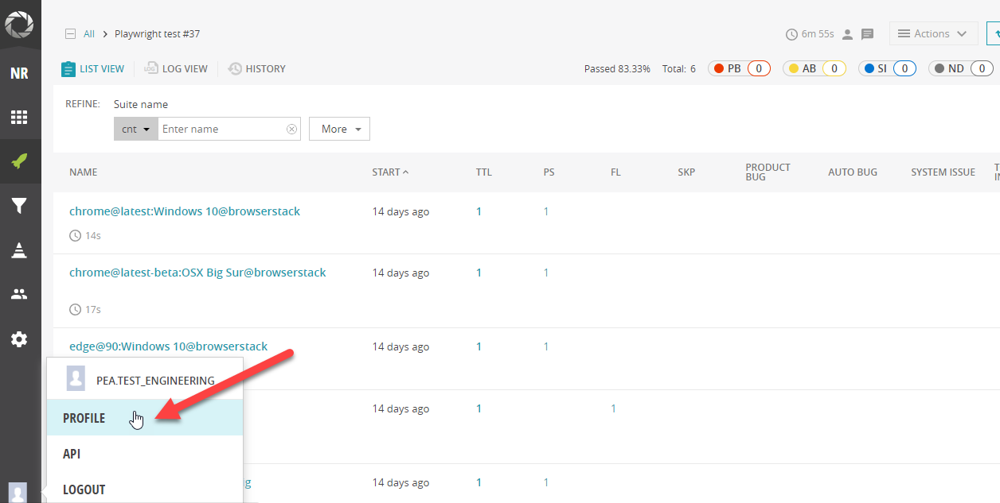
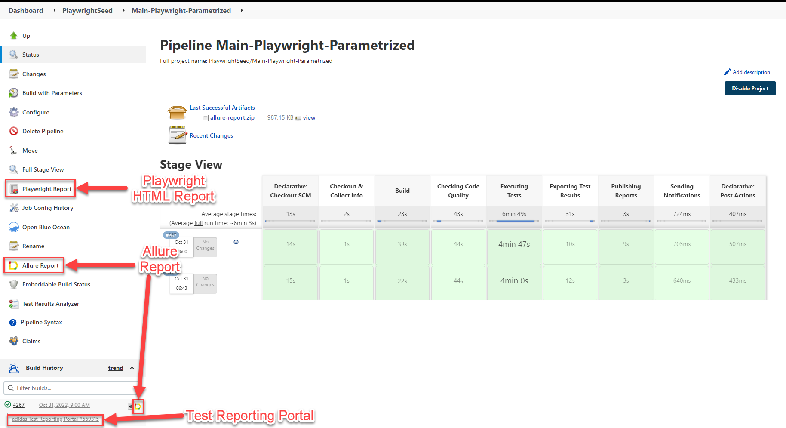
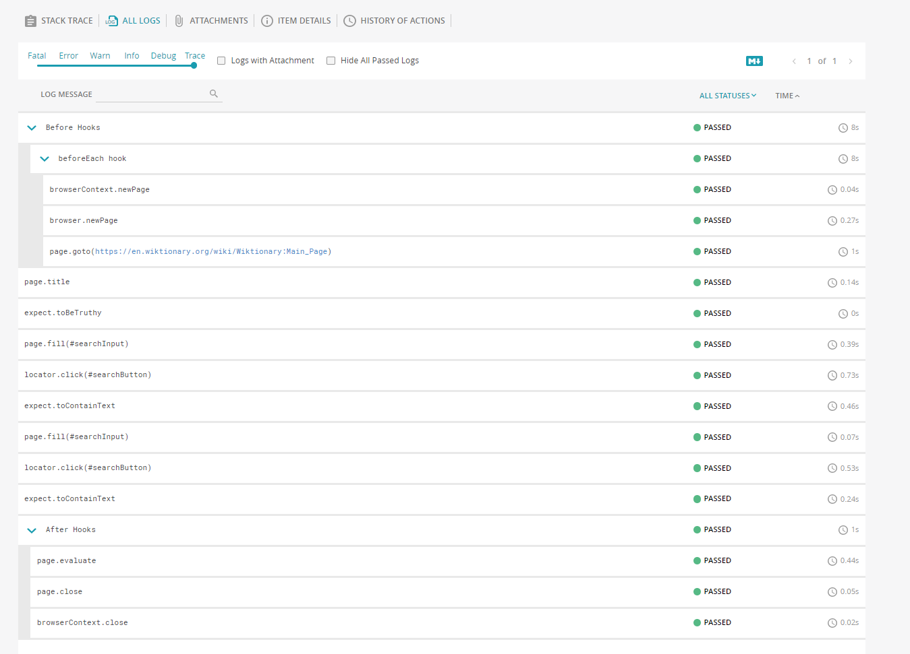

# 9.0 Integrate Test Reporting Portal

## 9.1 Introduction

In this section, we will add integration with Xray Test Management Tool to our pipeline:

- We will **execute tests coded in js format**. that are tagged with the @<JIRA-ID> 
- We will **push the results to Xray** after the execution to keep full traceability between User Stories, Tests and Test Executions.
  - If the test cases have NOT been pushed previously to Xray, the test cases will be created and linked to the test plan.  
  - If the tests cases have been executed previously, 

## 9.2 For Integrating Test Reporting Portal:

1. Get your TRP project configuration setting: Log-in TRP with your service account and choose the project you want to send your reports to.
   
2. Go to **User -> Profile** and you will find all the data you will need to configure the integration.

    

3. TRP configurations in [reportPortalProperties.js file](../../reportPortalProperties.js) :
    ```
    const RPconfig = {
      token: process.env.RP_TOKEN,                                                  //Update as per you needs
      endpoint: 'https://testreportingportal.tools.3stripes.net/api/v1',    //Do not modify
      project: process.env.RP_PROJECT,                                       //Update as per you needs
      launch: 'Jenkins test',                                            //Update as per you needs
      description: process.env.RP_DESCRIPTION,                               //Update as per you needs
    };
    ```
Here, the required variables, can be passed from jenkins file. Please refer the next steps.

4. Set rp.uuid value (from profile section)in Jenkins as secret.
In your Jenkins project, navigate to the "add credentials" option:

Kind: Choose "Secret text" option.
Secret: paste rp.uuid value.
ID: Choose your secret ID.(E.g RP_TOKEN in this case)
Description: Choose a description. (RP_DESCRIPTION in this case)

5. Add TRP set-up to your pipeline:
    - Add needed variables

        Set RP_TOKEN, RP_PROJECT and RP_DESCRIPTION as environment variables:
          
            def rpCredentials = "test-reporting-portal-pea-test_engineering" //UPDATE ACCORDING TO YOUR NEEDS
            def projectName = "te-seed-tas-playwright-js" //UPDATE ACCORDING TO YOUR NEEDS

            RP_TOKEN = credentials('test-reporting-portal-pea-test_engineering') //Update as required
            RP_PROJECT = 'te-seed-tas-playwright-js' //Update as required
          
6. Executing and Checking:
    - Now we have our pipeline completed.
    - Save all changes and push the Jenkinsfile to Bitbucket.
    - Execute the configured job.
    - Upon successful execution, the launch should be created in the Test Reporting Portal.
    - Additionally, the link to report portal should also be generated.

   

Continue to the next section - [08-Integrate with Xray](08-IntegrateXRAY.md).

## Note:

As per the configurations in this seed, the test steps will be recorded in the TRP launches:



Additionally, testInfo object(at test level) can be used to pass additional artifacts (like screenshots etc) to the test logs in TRP.

Or, you can use ReportingApi as demonstrated:

```
test('should contain logs with attachments',() => {
  const fileName = 'test.jpg';
  const fileContent = fs.readFileSync(path.resolve(__dirname, './attachments', fileName));
  const attachment = {
    name: fileName,
    type: 'image/jpg',
    content: fileContent.toString('base64'),
  };
  ReportingApi.log('INFO', 'info log with attachment', attachment);

  expect(true).toBe(true);
});
```
Please do not hesitate to reach out in case of any queries regarding the above!

Continue to the next section - [10-Integrate with XRay](10-IntegrateXRAY.md).

