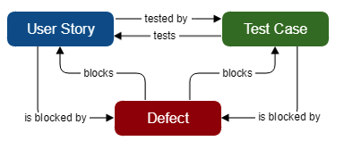

# 10.0 Integrate With XRay

## 10.1 Overview

In this section, we will add integration with Xray Test Management Tool to our pipeline:

- We will **execute tests coded in js format** which that are tagged with the test plan key(at test.describe level). To run these tests, the **Test Plan** Key should be specified in the command (**mandatory**)
- We will **push the results to Xray** after the execution to keep full traceability between User Stories, Tests and Test Executions.
    - If the test cases have NOT been pushed previously to Xray, the test cases will be created and linked to the test plan.
        - Link all new test cases to the proper(s) User Story(s) **This is some manual work that needs to be done in order to have full traceability**.
    - If the tests cases have been executed previously, they are already created and are supposed to be already linked to the proper User Story(s).

Please check our [jenkins file example](../../JenkinsFiles/Main-Playwright-Parametrized.groovy)

**Important note:** Any improvement, suggestion is more than welcome so please don´t hesitate to contact us at any time through our Microsoft Teams channel [SUPPORT_TESTING](https://teams.microsoft.com/l/channel/19%3a9887ce8b989549f7ba468c80885926da%40thread.tacv2/SUPPORT_TESTING?groupId=9ebcbabe-a60f-4b1f-bf48-a51d799159f0&tenantId=3bfeb222-e42c-4535-aace-ea6f7751369b) or via email [pea.test_engineering@adidas.com](mailto:pea.test_engineering@adidas.com).

## 10.1 Execute tests coded in js format

Pre-requisites:
- Test plan is already created in Jira (e.g. @TED-24886)
- Test plan key is added as a tag to the **test suite(test.describe block in our case)**. For example:
```
    /**Annotations added- @TED-24886 */
    test.describe('Wiktionary FE Test @FE @TED-24886', () => {

        //tests
    });
```

Now you only have to add --grep=@TED-24886 to your desired command. For example:
```
npx playwright test --config=./playwright-Moon.config.js --project='chromium@latest:Windows 10@moon' --grep=@TED-24886
```
Note!! - JIRA issue with type - "Test" are not directly compatible for XRAY Integrations in this seed. Recommended approach is to create a 'Test Plan' and add as @annotation to test.describe block

## 10.2 Push the results to Xray

Test execution will generate a junit report (reports/junit.xml). Now we export this report to the desired test plan (e.g. @TED-24886).

You can check 'Exporting Test Results' stage in our [jenkins file example](../../JenkinsFiles/Main-Playwright-Parametrized.groovy).

### 10.2.1 Link all new test cases to the proper(s) User Story(s)

If there are test cases that have NOT been pushed previously to Xray, these test cases will be created and linked to the test plan.

Here a manual process needs to be done in order to have full traceability:
- Tests plan should be linked to the proper user story in JIRA
  
  

This practice will allow us to:

- Keep full traceability between test results, test cases, user stories and defects.
- Feed the live reports
- Provide full transparency about the test activities, the test results and the current level of quality of the SUT.

Continue to the next section - [11-Reporting Aspects](11-ReportingAspects.md).
