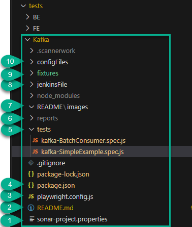

# 1. Kafka - Playwright Tests

This seed is intended to fast track the creation and configuration of Test Automation Solution for Kafka. 
This is a simple project to demo how you can extend your playwright test automation framework and use it to test the communication between Kafka **Producer** and **Consumer**.
## 2. Getting Started
### 2.1 Pre - Requisites

- Software to clone this repository (e.g. SourceTree, Git installed locally...)
- Docker setup locally (Please note docker for desktop is not allowed)
- [node.js](https://nodejs.org/)

### 2.2 Folder Structure

The **Kafka** folder inside the **tests** directory contains all the required dependencies, integrations, demo examples and jenkinsFiles for testing kafka communications.



1. **sonar-project.properties** -> Sonar properties file. Sonar project name can be modified here.
2. **README.md** -> File containing the documentation
3. **playwright.config.js** -> Playwright configuration file
4. **package.json** -> All the dependencies required for integrations are specified here. 
5. **tests** directory -> Demo examples on how to test Kafka Communications
6. **reports** -> Folder where allure and playwright HTML reports will be stored
7. **README** -> Folder containing resources used for documentation
8. **jenkinsFiles** -> Here you will find Groovy pipelines examples for Jenkins. 
9. **fixtues** -> Kafka Fixtures for setting up Kafka and Zookeeper using testcontainers library.
10.  **configFiles** -> Config files used in CI process

### 2.3 Run your Kafka Tests

Steps to execute your first Kafka test:
- Clone this repo.
- Switch to **tests/Kafka** Directory by running the command in the terminal:
    ``` 
    cd tests/Kafka 
    ``` 
- Install all the dependencies by executing:
    ``` 
    npm install 
    ```
- To run tests:
    ```
    npx playwright test
    ```
- The above command will execute all the tests inside the **tests** directory in **Kafka** folder. Generated reports can be accessed from **reports** folder.

#### Note:
- Since we are using testcontainers which uses docker to spin up containers, please make sure docker is properly setup. 
- Whitelist IPs by using allow me- https://allow-registry.tools.3stripes.net for local executions.
- Recommended to use docker CLI compatible terminal (WSL for windows)

### 2.4 Kafka Fixtures in the seed

- File path: [kafkaFixtures.js](fixtures/kafkaFixtures.js)
- Here we are using testcontainers-nodejs library to setup Kafka and Zookeeper containers:
    
    **kafkaFixtures.js**
    ```
    const { KafkaContainer, GenericContainer, Network } = require("testcontainers");


    exports.test = base.test.extend({

    kafkaContainer: async({ }, use, testInfo) => {

        if((testInfo.title).match(/Using custom zoo-keeper/)){
            
            console.log("Connecting using custom zoo-keeper and network")

            const network = await new Network().start();
            let zooKeeperHost = "zookeeper";
            let zooKeeperPort = 2181;

            const zookeeperContainer = await new GenericContainer(`${DOCKER_PRIVATE_REGISTRY}/${ZOOKEEPER_IMAGE_HARBOR}`)
                .withNetwork(network)
                .withNetworkAliases(zooKeeperHost)
                .withEnvironment({ ZOOKEEPER_CLIENT_PORT: zooKeeperPort.toString() })
                .withExposedPorts(zooKeeperPort)
                .start();

            const kafkaContainer = await new KafkaContainer()
                .withNetwork(network)
                .withZooKeeper(zooKeeperHost, zooKeeperPort)
                .withExposedPorts(9093)
                .start();
            
            await use(kafkaContainer);

            await zookeeperContainer.stop();
            await kafkaContainer.stop();
            await network.stop();
        }
    ..

    ```
- Next, we are using the generated 'kafkaConatiner' fixtures to create the kafka client configuration:
    
    **kafkaFixtures.js**
    ```
    const { Kafka, logLevel} = require('kafkajs')

    exports.test = base.test.extend({

        kafka: async({ kafkaContainer }, use) => {

        const kafka = new Kafka({
            logLevel: logLevel.NOTHING,
            brokers: [`${kafkaContainer.getHost()}:${kafkaContainer.getMappedPort(9093)}`],
        })

        await use(kafka); 

        }

        ..
    ```
- Finally, this **{kafka}** fixture is used in the tests to create Kafka **producer** and **consumer**. 
    
    **kafka-BatchConsumer.spec.js**
    ``` 
        test.beforeEach( async ( { kafka } ) => {

        producer = kafka.producer();

        consumer = kafka.consumer({ groupId: "test-group" });
        
        await Promise.all([producer.connect(), consumer.connect()])

    })
    ```
- The benefit of using fixtures is easy encapsulation, and complete isolation between different tests. Playwright runner will take care of setting up and closing the fixtures automatically. More about fixtures - https://playwright.dev/docs/test-fixtures.

### 2.5 Kafka Configurations and Usage options in this seed

#### 2.5.1 Configurations

In this seed, we have covered the following examples for Kafka setup using testcontaines library:
- **Connect to Kafka using custom zoo-keeper**: Built using the "confluentinc/cp-zookeeper:6.1.1" image available in Harbor. This is also the default configuration.
- Using custom Kafka Image(available in harbor) and built in zookeeper
- Using built-in zoo-keeper and custom network

These can be customised further and/or extended to include more properties (SSL Listener integration for instance)


You can reach out to us on SUPPORT_TESTING channel in case any assistance is required! 😊

### 2.5.2 Usage

- The configuration above are implemented in **kafkaFixtures.js** file as the **kafkaContainer** fixture, E.g. :

    ```
    exports.test = base.test.extend({

    /** Creating kafkaContainer Fixture */
    
    kafkaContainer: async({ }, use, testInfo) => {

        if((testInfo.title).match(/Using custom zoo-keeper/)){
            // code logic

            await use(kafkaContainer);
        }

    }
    })
    ```
- In the test spec files, **kafka-BatchConsumer.spec.js** and **kafka-SimpleExample.spec.js**, the tests are parameterised and to execute for all the above setup configurations.
    ```
        /** Zookeepr and Kafka setup Options - Implemented as fixtures in kafkaFixtures.js*/
    const KAFKA_SETUP = [
        'Using custom zoo-keeper',
        'Using custom Kafka Image and built in zookeeper',
        'Using built-in zoo-keeper and custom network'
    ]

    for(const configuration of KAFKA_SETUP){
        test(`${configuration} - Simple kafka test with Consumer consuming messages in Batch`, async({  }) => { ...})
    }
    ```
- This is a demo example and you can further customise tests as applicable.
## 2.6 Demo Examples in this seed

We have included 2 demo examples in this seed.

- **Test Data**: For demo example, we are generating test data using 'chance' npm package, which is generating random test data values, and used to create key, value pairs.
    ```
          messages = Array(messageLength).fill().map((_, i) => {
            const value = chance.animal()
            return { key: `key-${i}`,value: `${value}`}
        })
    ```
- **Producer**: 
  - Is created using kafka fixture
  - The method *send* is used to publish messages to the Kafka cluster.
    ```
    await producer.send({ acks: -1, topic: topicName, messages: [each]})
    ```
  - Customise as necessary.
- **Consumer**:
  - Is created using kafka fixtures
  - KafkaJS provides two handles for consuming messages: 
    - *eachBatch* handle, which consumes messages in batches. Useful when more flexibility is needed.
    - *eachMessage* handle, which consumes single message at a time(This is implemented as an API on top of eachBatch handle. Please take care of proper configurations if using this to avoid issues.)

## 3. References

- [KafkaJS](https://kafka.js.org/docs/introduction)
- [Testcontainers for Node.js](https://testcontainers.com/guides/getting-started-with-testcontainers-for-nodejs/)